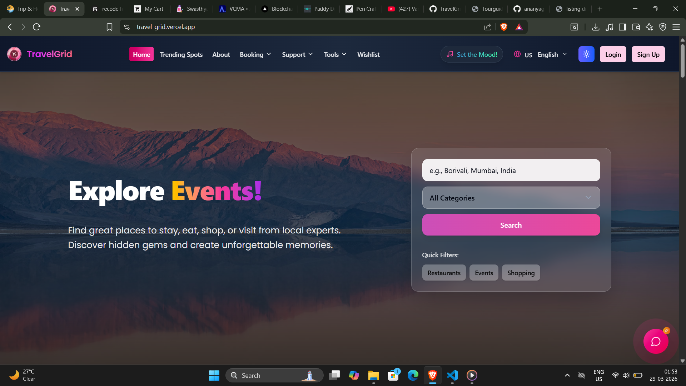

# ✈️ Travel



🔗 **Live Demo**: https://travel-grid.vercel.app/  
📂 **Repository**: https://github.com/wbsanjar/travel  

---

## 🌍 About Travel

**Travel** is an all-in-one travel platform where users can:

- 🎟️ Book tickets  
- 🚗 Rent vehicles  
- 🏨 Reserve hotels  
- 📖 Access travel guides  
- 🎒 Choose customized travel packages  

Built with scalability and user experience in mind.

---

## 🚀 Open Source Program

This project is part of **GirlScript Summer of Code (GSSoC) 2025**, one of India's largest open-source initiatives.

It helps developers:
- Gain real-world experience  
- Collaborate with others  
- Improve coding skills  
- Get mentorship & recognition  

---

## 📊 Project Stats


---

## ⚙️ Tech Stack

- **Frontend**: React + Vite + Tailwind CSS  
- **Backend**: Node.js + Express  
- **Database**: MongoDB  

---

## 🛠️ Getting Started

### 📌 Prerequisites

- Node.js (v16+)
- npm / yarn
- Git
- VS Code (recommended)

---

### 📥 Installation

```bash
# Clone repo
git clone https://github.com/wbsanjar/travel.git

cd travel
